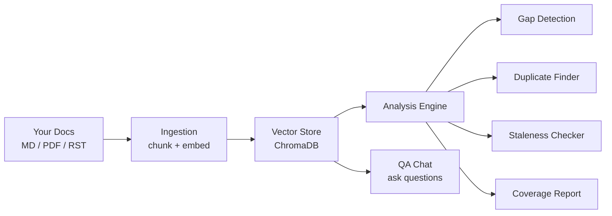
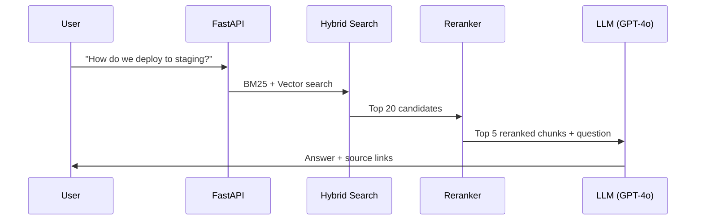
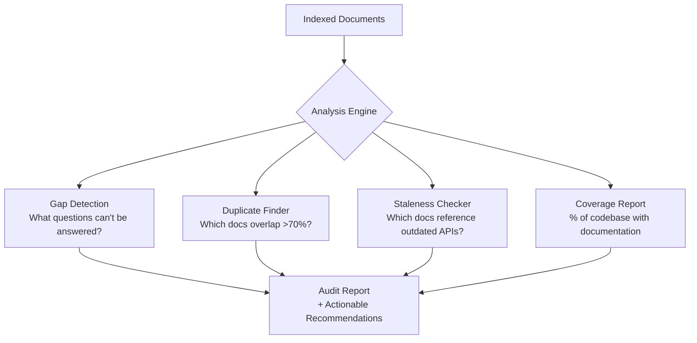

# ai-knowledge-agent

AI-powered documentation audit tool: finds gaps, duplicates, and outdated content in your knowledge base using RAG.

## The Problem

Engineering teams lose **~30% of their time** searching for information scattered across Confluence, GitHub wikis, Notion, and internal docs. But the real problem isn't search — it's that nobody knows:

- which topics have **no documentation at all** (gaps);
- which docs **say different things** about the same topic (contradictions);
- which docs **haven't been updated** in months while the code changed (staleness);
- which docs are **near-duplicates** wasting maintenance effort.

Existing tools help you *find* docs. This tool tells you **what's wrong with them**.

## How It Works

### Architecture



### Query Flow



### Analysis Flow



## Features

### Available Now

- **document ingestion** — load Markdown, PDF, and RST files from local directories;
- **smart chunking** — splits by headings and semantic boundaries, not arbitrary character counts;
- **semantic search** — ask questions in natural language, get answers with source references;
- **QA chat** — conversational interface with context memory.

### In Progress

- **gap detection** — analyzes user queries to find undocumented topics;
- **duplicate finder** — identifies docs with >70% semantic overlap;
- **staleness checker** — flags docs that reference changed code / APIs;
- **coverage report** — visual dashboard of documentation health.

### Planned

- multi-source ingestion (Confluence API, GitHub repos);
- automated re-indexing on git push (n8n / GitHub Actions);
- team analytics (who asks what, trending questions);
- self-hosted and SaaS options.

## Tech Stack

| Layer | Technology | Why |
|-------|-----------|-----|
| Ingestion | LlamaIndex | Best-in-class document loaders and chunking |
| Vector Store | ChromaDB | Free, local, no infra needed for MVP |
| Search | Hybrid (BM25 + vector) | 1-9% better recall than pure vector search |
| Reranking | Cross-encoder | Precision boost on top of hybrid search |
| LLM | OpenAI API (GPT-4o) | Quality. Swappable to Ollama for local/free |
| API | FastAPI | Async, fast, auto-docs |
| UI | Streamlit | Rapid prototyping for demo/MVP |
| Automation | n8n | Visual workflow builder for pipelines |

## Project Structure

```
ai-knowledge-agent/
├── src/
│   ├── ingest/
│   │   ├── loader.py        # Document loading (MD, PDF, RST)
│   │   ├── chunker.py       # Heading-aware chunking
│   │   └── embedder.py      # Embedding generation + storage
│   ├── search/
│   │   ├── hybrid.py        # BM25 + vector search
│   │   └── reranker.py      # Cross-encoder reranking
│   ├── qa/
│   │   └── chain.py         # Conversational QA with memory
│   ├── analysis/
│   │   ├── gaps.py          # Undocumented topic detection
│   │   ├── duplicates.py    # Semantic duplicate finder
│   │   ├── freshness.py     # Staleness scoring
│   │   └── coverage.py      # Documentation coverage report
│   └── api/
│       └── main.py          # FastAPI endpoints
├── tests/
├── ui/
│   └── app.py               # Streamlit demo
├── docs/                     # Project documentation
├── docker-compose.yml
├── requirements.txt
└── README.md
```

## Quick Start

### Prerequisites

- Python 3.11+;
- OpenAI API key (or Ollama for local LLM).

### Installation

```bash
git clone https://github.com/YOUR_USERNAME/ai-knowledge-agent.git
cd ai-knowledge-agent
python -m venv venv
source venv/bin/activate  # Windows: venv\Scripts\activate
pip install -r requirements.txt
cp .env.example .env      # Add your OpenAI API key
```

### Index Your Docs

```bash
python -m src.ingest.loader --path ./your-docs-folder
```

### Ask Questions

```bash
python -m src.qa.chain "How do we deploy to production?"
```

### Run the API

```bash
uvicorn src.api.main:app --reload
# Open http://localhost:8000/docs for Swagger UI
```

### Run with Docker

```bash
docker-compose up
# API: http://localhost:8000
# UI:  http://localhost:8501
```

## Roadmap

- [x] Project setup and architecture
- [ ] Document loader (Markdown, PDF, RST)
- [ ] Heading-aware text chunking
- [ ] Embedding pipeline + ChromaDB storage
- [ ] Semantic search (vector)
- [ ] Hybrid search (BM25 + vector + reranker)
- [ ] QA chain with conversation memory
- [ ] FastAPI REST API
- [ ] Streamlit demo UI
- [ ] Gap detection module
- [ ] Duplicate detection module
- [ ] Staleness scoring module
- [ ] Coverage dashboard
- [ ] Multi-source support (Confluence, GitHub)
- [ ] Docker deployment
- [ ] n8n automation workflows
- [ ] Landing page + waitlist

## Contributing

This project is in early development. If you're interested in contributing:

1. Open an issue to discuss what you'd like to work on.
2. Fork the repo.
3. Create a feature branch (`git checkout -b feature/your-feature`).
4. Commit your changes.
5. Open a pull request.

## License

MIT

## Author

[Anna Goncharova](https://www.linkedin.com/in/ann-goncharova/) — Staff Documentation Engineer, 6 years building knowledge systems at scale.
